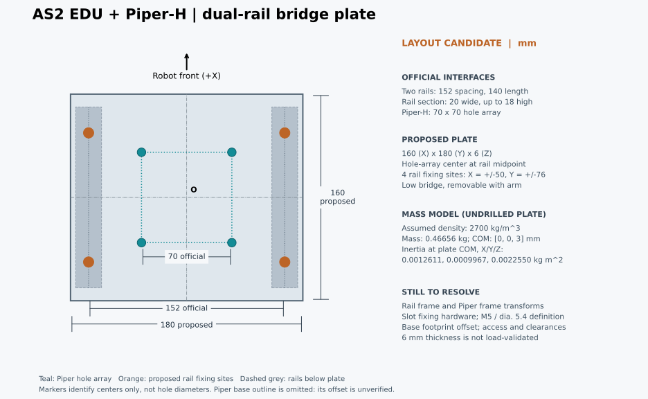

# AS2 EDU + Piper-H 装配依据

当前模型是早期研究仿真假设：`configs/as2_piper.json` 将 `piper_base_link` 以 `xyz=[0,0,0.12]`、零旋转直接固定到 `base_link`，安装件无质量。它没有还原背部导轨和转接板，不能作为真实 AS2 EDU + Piper-H 装配。历史模型与实验保留此定义以便复现；新的目标域学习应先确定真实装配。

实际装配链应为：**AS2 机身 → 背部导轨 → 匹配的固定件/转接板 → Piper-H 底座**。源 AS2 URDF 没有独立导轨 frame；Piper-H 首关节的源模型高度也不是转接板高度。

## 官方 AS2 背部接口

2026-09-13 实际读取用户提供的[宇树《关于 As2》手册](https://support.unitree.com/home/zh/AS2_SDK_Development_Guide/about_as2)，页面标注更新于 2026-09-02。在“部件名称”下找到并视觉读取了[背部负载安装孔位图，单位 mm](https://doc-cdn.unitree.com/static/2026/6/25/0ad8b87e21b4418c8198dc98f1b72c23_1245x470.png)。之前仅凭源 URDF/产品页未找到安装图，不能据此说官方未提供接口尺寸。

| 图中明确标注 | 尺寸 |
|---|---:|
| 两轨孔中心线间距 | 152 mm |
| 单轨纵向长度 | 140 mm |
| 纵向孔距及端距 | 10 + 60 + 60 + 10 mm |
| 截面外宽 / 最大高度 | 20 / 18 mm |
| 槽开口 / 槽内宽 | 6 / 10 mm |

完整槽形以原图为准，不能仅凭上述尺寸选择螺纹规格或紧固力矩。截面 18 mm 是导轨自身尺寸，**不是** `base_link` 到安装面的高度。该图没有建立导轨与当前 URDF `base_link` 的完整坐标关系，也没有给出 Piper-H 转接板。

该手册 EDU 栏还确认带电池约20 kg、持续行走负载约15 kg；这些整机规格不能替代具体伸展姿态下的安装件载荷验算，也不能确定源模型缺失质量的位置。

## 官方 Piper-H 安装接口与负载曲线

用户提供的[松灵手册](https://agilexsupport.yuque.com/staff-hso6mo/alxgtf/ay1awrn2hrhn1krg?singleDoc)明确标为 **PIPER H**，本次读取内容标注更新于2026-08-11。2.4.1节文字给出底座四个M5螺纹通孔、70×70 mm孔距；[对应安装原图](https://cdn.nlark.com/yuque/0/2025/png/33709157/1767175387998-59ffc4b5-8070-4a90-8e1e-bfc62c6f6efe.png)给出80×95 mm外形、70×70 mm四孔，但孔标注为“φ5.4贯穿”。孔距可以作为布局依据，文字与图的螺纹/间隙孔差异须确认对应零件，不能据此直接确定加工和紧固规格。此前未确认普通Piper尺寸是否适用H的缺口，现由这份明确H手册补足。

2.3节提供[机械臂末端负载曲线](https://cdn.nlark.com/yuque/0/2026/png/29291030/1769355605793-4eaabd51-7c61-4ed5-86f7-593e45b9b6f4.png)，横轴L(mm)、纵轴Z(mm)，2 kg曲线在横轴上的读数为500 mm。但图和相邻正文没有定义L/Z参考原点、末端姿态、负载COM或动态条件。**不能把500 mm当成base到TCP的工作半径，也不能当成负载质心偏距**，因此不能由该数值与636.65 mm工作半径的大小关系判定满伸展2 kg允许或不允许。当前2 kg点质量候选仍只是仿真压力条件，不能标成厂商认证的全伸展负载域。

同册的[H模型文件页](https://agilexsupport.yuque.com/staff-hso6mo/alxgtf/glzd7a853owrmsk0)列出“PIPER-H外发.tar”；本次未取得可核验的归档内容，未以它认定底座坐标或孔的加工定义。

## 第一版安装布局候选

当前尚未选购转接板，先采用**可拆卸的双导轨横跨板，Piper孔阵列左右居中、纵向对齐导轨中点**作为布局候选。沿轨位置以后按机械臂工作区、整机COM和附件空间调整；本候选尚未替换运行中的历史资产。

设O位于两轨纵向中点之间、导轨上接触面的中心，X向机器人前方，Y向左，Z向上。下表除厂商孔距外均为本次设计选择；紧固点位置不代表已确定孔型或螺纹规格。

| 项目 | 首版候选 |
|---|---|
| 板件尺寸 X×Y×Z | 160×180×6 mm；6 mm尚未进行载荷/刚度验证 |
| 导轨侧四个固定点 X/Y | (±50, ±76) mm；采用匹配实际槽型的固定件，避开原导轨固定螺钉 |
| Piper侧四孔中心 X/Y | (±35, ±35) mm，对应官方70×70 mm孔阵列 |
| 机械臂朝向 | 工作区优先朝机器人前方；源底座轴和接插件方向核对后才确定URDF旋转 |
| 板材密度计算假设 | 2700 kg/m³，具体铝材和固定件尚未选定 |
| 未开孔板质量 / COM相对O | 0.46656 kg / [0,0,3] mm，不含螺钉、滑块、线缆 |
| 板自身COM处惯量 Ixx/Iyy/Izz | 0.00126111168 / 0.00099672768 / 0.00225504 kg·m²，积惯量为0 |

质量由`ρ×长×宽×厚`计算，惯量使用均匀长方体公式。开孔和紧固件选定后重新计算，不能把该板质量当作全部缺失附件质量，也不能用它解释源AS2与EDU标称20 kg的差额。

Piper安装图的φ72圆心距右/下外形边各40 mm，但没有把圆心命名为机械臂轴线或URDF原点；70×70孔阵列相对80×95外形的完整定位尺寸也未明确。因此图中只画孔中心，未将底座外形、孔阵列与URDF原点强行同心。后续变换应按`T(base←Piper)=T(base←O)·T(O←安装孔阵列)·T(安装孔阵列←Piper)`组合；其中板厚贡献6 mm，不能继续沿用旧0.12 m总高。

这版确定的是布局。生成物理资产前仍需定位两端坐标基准，并检查横跨板与机身盖的竖向间隙、电池取出通道、雷达、机械臂运动和线缆空间；选定紧固件后再验证板件与连接在相应姿态/动态载荷下的承载。原始计算和PNG预览保存在本地`outputs/as2-mount-layout-20260913/`。

## 尚需确定的装配量

1. 导轨安装面/选定固定位置相对当前 `base_link` 的位置和方向，明确实物与源模型采用同一基准。
2. Piper-H 70×70 mm孔阵列对应的螺纹/间隙孔关系、底座坐标轴及接触面定义。
3. 所选转接件的厚度、沿轨位置、机械臂朝向、质量、COM 和惯量；附件质量分别计入实际位置。

得到这些量后再组合各段刚性变换并重建资产。安装件可合并为固定刚体的质量与惯量，但其空间位置和必要碰撞几何须保留。随后重算整机 COM、伸展负载条件和碰撞/可达范围，再生成预训练资产族。现有静态 COM 与消费检查只对旧假设资产有效。
